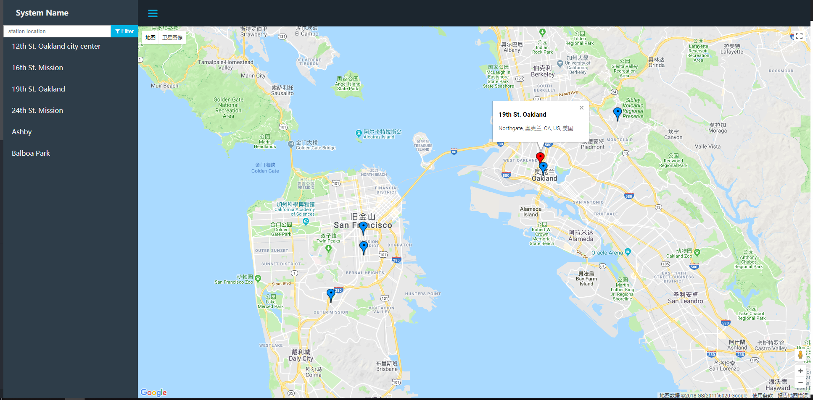
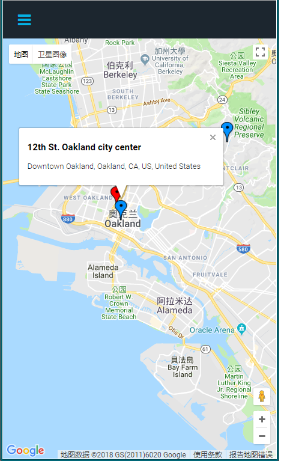

# frontend-nanodegree-street-map
udacity frontend project 5

## Install dependencies

To install via npm :
```bash
npm install
```

To install via yarn:
```bash
yarn install
```

## Usage 
open the file `index.html` in browser.




